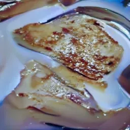
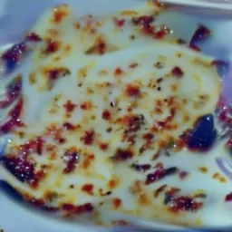

# Text-to-image-diffusion-model-for-school

Very simple conditional image generation model I was asked to create for a research project for school
alot of stolen documentation code from hugging face but it works and works pretty well in my short testing
as I had to give up after 4 months of working on it as the school server I was using was needed for something more important

These were generated off a rtx quadro 8000, 1.5k dataset at 130 epochs 

 

Feel free to build off, steal or whatever you would like 
